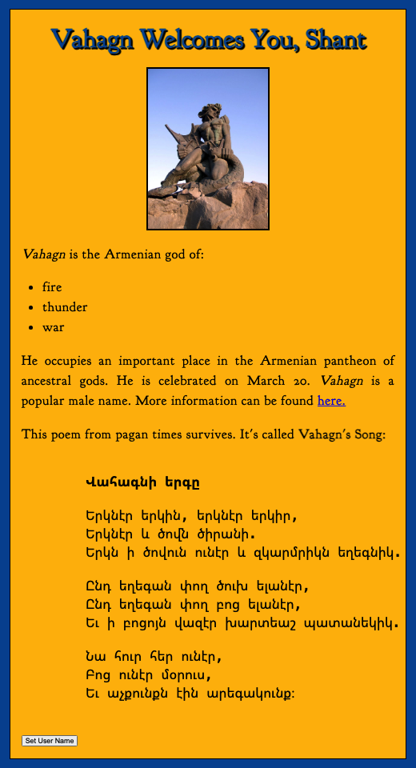

# Vahagn

An informational and interactive web page about [Vahagn](https://en.wikipedia.org/wiki/Vahagn), the Armenian God of Thunder.

## Motivation

As an Armenian, learning and preserving my ethnic heritage is a sacred duty. I built this page to inform my fellow Armenians about Vahagn, our Armenian God of thunder, war, and fire. Our native faith gods and goddesses inspire us to become the best version of ourselves.

